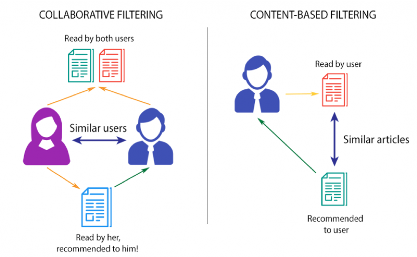
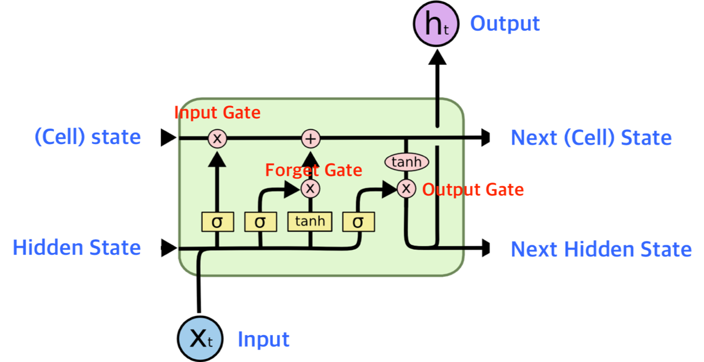
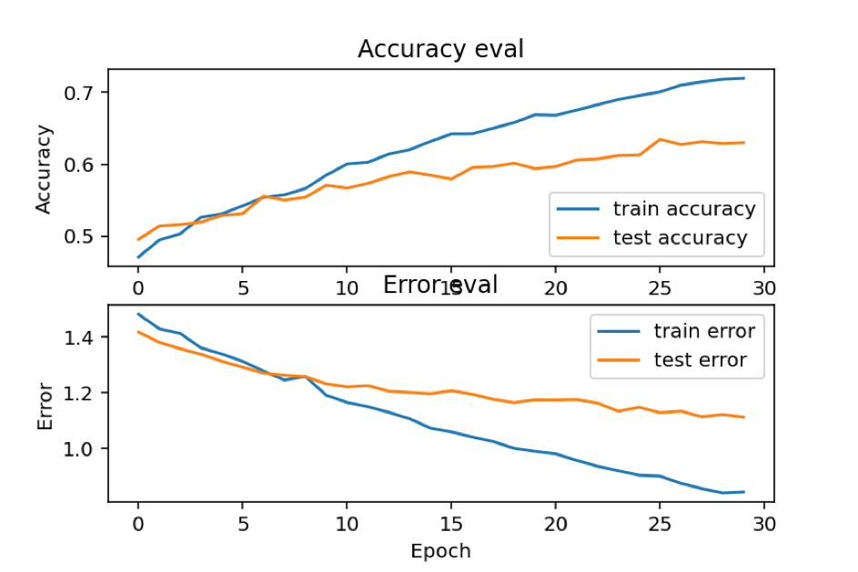

Section4_project
=============

**♦︎프로젝트 목표:** 
- Youtube 광고 및 추천영상, Spotify의 음악추천, Netflix의 영상추천 알고리즘에 대한 분석.
- 추천 알고리즘을 더 발전시키기위한 방안과, 음악의 파형분석, MFCC추출을 어떤 방식으로 사용할 수 있는지 프로젝트를 통해 구현.  
**♦︎추천 알고리즘** 

- 추천 알고리즘은 대표적으로 2가지로 나누는데 이때 구분하는 기준은 어떤 데이터를 사용하느냐에 따라 구분.  
  1. Collaborative filtering(협업 필터링) : 각각의 사용자와 아이템에 대하여 프로필을 작성하고, 이를 기반으로 추천. 
      1. 영화 추천을 예시로 들어보면, 먼저 사용자에 대해서 성별, 연령대, 지역 등의 프로필을 작성하고 나와 프로필이 비슷한 다른 사용자가 선호하는 영화를 추천해주는 방식. (user-based recommendation)
      2. 다음으로 영화는 장르, 출연하는 배우들, 흥행 여부 등의 프로필을 작성할 수 있음. 이를 기반으로 특정 영화를 좋아했던 사용자에게 비슷한 영화를 추천. (item-based recommendation)
    대량의 데이터를 처리하기에는 비효율적이며, 데이터를 입력할 때 주관적인 생각이 들어갈 가능성이 있음.  
  2. Content-based filtering(콘텐츠 기반 필터링) : 프로필 데이터 없이, 사용자의 과거 행동 데이터만 가지고 추천을 진행. 왓챠를 떠올려보면 사용자는 자신이 본 영화들에 대해서 1점부터 5점까지 평점을 남깁니다. 이제 이 평점들을 가지고 사용자의 취향을 파악한 뒤, 선호할 만한 영화를 추천해주는 방식. 
   - 이 방법의 장점은 도메인에 제약없이 데이터 셋을 쌓기가 쉽다는 것. 또한 일반적으로 Contents Based Filtering 보다 더 정확하다고 알려져 있음.
   - 하지만 신규사용자의 경우 관찰된 행동 데이터가 없고 이런 경우 정확도가 떨어진다는 단점이 있음.  
**♦︎RNN** 

- 음악 데이터의 특징은 자연어 데이터와 마찬가지로 순차적 데이터라고 할 수 있음. 음의 순서가 바뀌거나 intro와 후렴의 순서가 바뀌어버리면 다른 음악이 될 수 있음.
- librosa 라이브러리를 통해 MFCC라는 벡터화된 특징으로 데이터를 뽑아낼 수 있음. 파형 이미지 또한 추출 가능.
- MFCC 또한 순차적으로 들어가서 모델이 학습되어야하기 때문에 RNN중에서 LSTM을 활용하여 분석.  
**♦︎사용한 데이터 및 라이브러리** 
- GTZAN 데이터 세트(https://www.kaggle.com/andradaolteanu/gtzan-dataset-music-genre-classification)
- librosa(https://librosa.org/doc/latest/index.html)
- LSTM(https://keras.io/api/layers/recurrent_layers/lstm/)  
**♦︎결론** 
 
- Epoch을 30으로 줬을 때, 의미있게 꺾이는 부분이 없음.
- Epoch을 50으로 주고 다시 학습시키면 0.7101으로 30회보다 0.12정도 높아졌지만 그래도 과소적합이라는 판단.
- 추천 알고리즘의 정확성을 높이려는 프로젝트라기보다는 분류모델을 만들어서 자동 레이블링이 가능하게 한 프로젝트.
- librosa로 파형 이미지 또한 얻을 수 있는데, 이를 진행해보지 못했고 사실 이미지로 진행을 했다면 GAN을 통한 파형이미지 생성 후 변환작업을 거쳐 새로운 음악을 만들 수도 있었을 것이라 예상.
- Basic 모델이라 기존의 다른 모델과 hybrid하여 사용하는 방식으로 사용해야 될 것이라 생각함.  
**♦︎발표자료** 
- Colab Notebook : https://github.com/phdo94/Section4_project/blob/main/AI_02_%EB%B0%95%ED%97%8C%EB%8F%84_Section4_project.ipynb
- pptx : https://github.com/phdo94/Section4_project/blob/main/AI_02_%EB%B0%95%ED%97%8C%EB%8F%84_Section4_project.pptx(다운로드 필요!)
- 발표영상 : https://github.com/phdo94/Section4_project/blob/main/AI_02_%EB%B0%95%ED%97%8C%EB%8F%84_Section4_project.mp4(다운로드 필요!)
